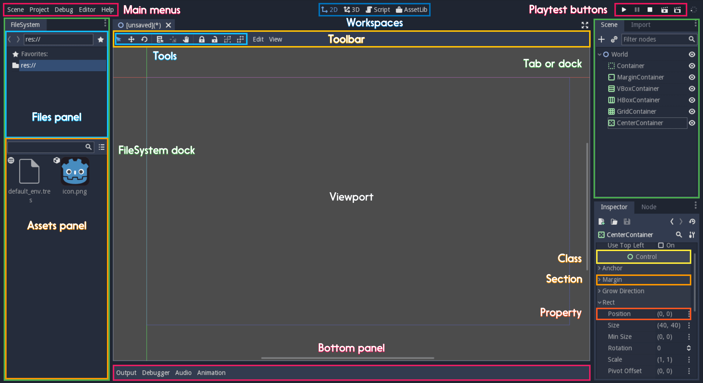

# Class Reference Writing Styleguide

The Godot community is rich and international. Users come from all around the world. Some of them are young, and many aren't native English speakers. That's why we must all write using a clear and a common language. For the class reference, the goal is to make it easy to read for everyone and precise.

Always try to:

1. Use the direct voice
1. Use precise action verbs
1. Avoid verbs that end in -ing
1. Use explicit references
1. Abuse 's to show posession
1. Remove unnecessary adverbs and adjectives.
1. Mention what methods return if it's useful

## Writing guidelines
### Use the direct voice

Use the direct voice when possible. Take the classes, methods, and constants you describe as the subject. It's natural to write using the passive voice, but it's harder to read and produces longer sentences.

Most of Godot 2's API documentation uses the passive voice:

```
void edit_set_pivot ( Vector2 pivot )
[...] This method is implemented only in some nodes that inherit Node2D.
```

You can use the node's name as a noun:

```
void edit_set_pivot ( Vector2 pivot )
[...] Only some Node2Ds implement this method.
```


### Use precise action verbs

Favor precise yet common verbs over generic ones like `make`, `set`, and any expression you can replace with a single word:

```
void edit_set_pivot ( Vector2 pivot )
Set the pivot position of the 2D node to ‘pivot’ value. [...]
```

The method's name already states it sets the pivot value to a new one. The description should explain what's the consequence of this "set": to place or position for position, rotate, fade, etc.

```
void edit_set_pivot ( Vector2 pivot )
Position the node's pivot to the 'pivot' value. [...]
```

### Avoid verbs that end in -ing

The progressive forms describe continuous actions. You don't need it to describe methods that do their job instantly. Use simple present, preterit or future.

```
Vector2 move ( Vector2 rel_vec )
Move the body in the given direction, stopping if there is an obstacle. [...]
```

```
Vector2 move ( Vector2 rel_vec )
Moves the body in the vector's direction. The body stops if it collides with an obstacle. [...]
```

Some verbs can also turn into adjectival nouns with -ing: `the remaining movement`, `the missing file`, etc. This is different so feel free to use them.


### Use explicit references

Favor explicit references over implicit ones.

Avoid using words like "the former", "the latter", etc. They're not the most common in English, and they require you to check the reference.

``` markdown
'w' and 'h' define right and bottom margins. The **latter** two resize the texture so it fits in the defined margin.
```

Don't be afraid of repetition in documentation or tutorials:

``` markdown
'w' and 'h' define right and bottom margins. **'w' and 'h'** resize the texture so it fits the margin.
```

### Abuse 's to show posession

Avoid "The milk of the cat" feels unnatural in English. Write "The cat's milk" instead.

``` markdown
The region **of the AtlasTexture** that is used.
```

`'s` lets you put the main subject at the start of the sentence, and keep it short:

``` markdown
The **AtlasTexture's** used region.
```

### Remove unnecessary adverbs and adjectives.

Write as few adjectives and adverbs as possible. Only use them if they add key information to the description.

``` markdown
**Basically** a big texture [...]
```

Ban adverbs like "basically", "effectively", and adjectives like "actual". Words that lengthen the documentation but don't add any information.

``` markdown
A big texture [...]
```

### Mention what methods return if it's useful

Some methods return important values. Describe them at the end of the description, ideally on a new line. No need to mention the return values for any method whose name starts with `set` or `get`.

```
Vector2 move ( Vector2 rel_vec )
[...] The returned vector is how much movement was remaining before being stopped.
```

Use "Returns". Notice the exception to the "direct voice" rule: in the move method, an external collider can influence and act upon it. In this case, you can use the passive voice:

```
Vector2 move ( Vector2 rel_vec )
[...] Returns the remaining movement before the body was stopped.
```

## Common vocabulary

The developers chose some specific words to refer to areas of the interface. They're used in the sources, in the documentation, and you should always use them instead of synonyms, so the users know what you're talking about.



In the top left corner of the editor lie the `main menus`. In the center, the buttons change the `workspace`. And together the buttons in the top right are the `playtest buttons`.
The area in the center, that displays the 2d or the 3d space, is the `viewport`. At its top, you find a list of `tools` inside the `toolbar`.

The tabs or dockable panels on either side of the viewport are `docks`. You have the `FileSystem dock`, the `Scene dock` that contains your scene tree, the `Import dock`, the `Node dock`, and the `Inspector` or `Inspector dock`. With the default layout you may call the tabbed docks `tabs`: the `Scene tab`, the `Node tab`...

The Animation, Debugger, etc. at the bottom of the viewport are `panels`. Together they make up the `bottom panels`.

Foldable areas of the Inspector are `sections`. The node's parent class names, which you can't fold, are `Classes` e.g. the `KinematicBody2D class`. And individual lines with key-value pairs are `properties`. E.g. `position` or `modulate color` are both `properties`.
