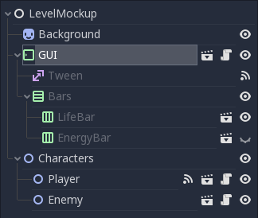
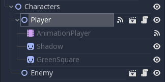
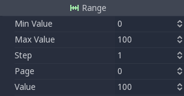
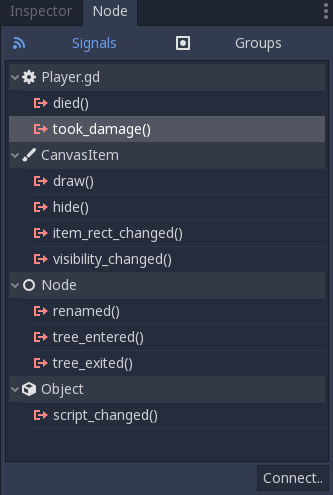
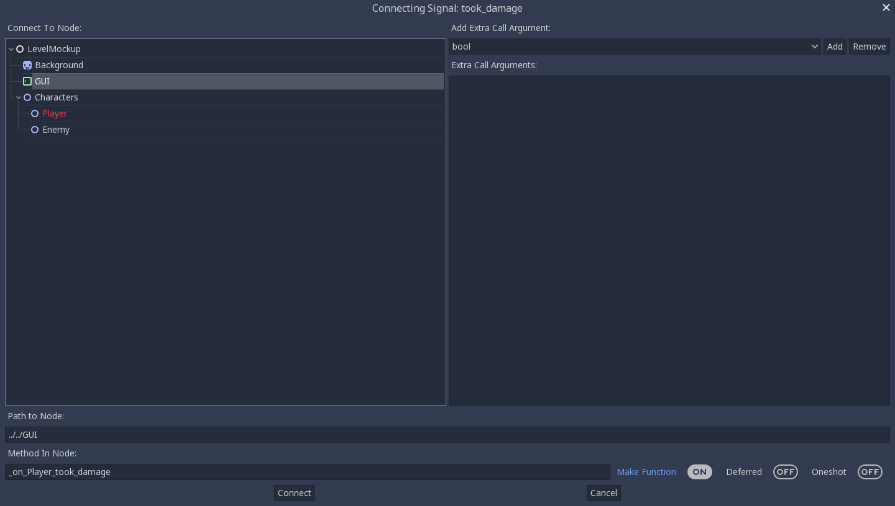
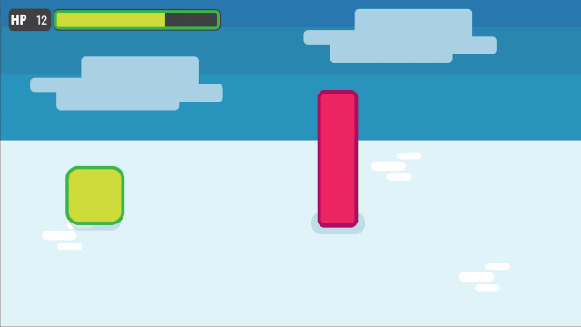
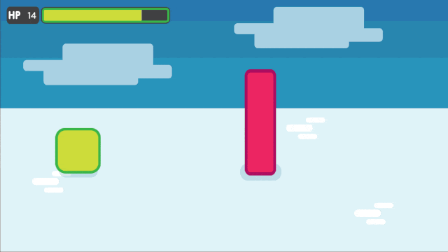
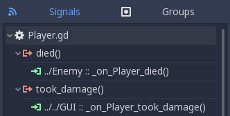

# Control the game's UI with code

## Intro

In this tutorial you will connect a character to a life bar and animate the health loss.


You will learn:

- How to **connect** a character to a GUI with signals
- How to **control** a GUI with GDscript
- How to **animate** a life bar with the [ Tween ](#) node

If you want to learn how to set up the interface instead, check out the step-by-step UI tutorials:

- Create a main menu screen
- Create a game user interface


When you code a game, you want to build the core gameplay first: the main mechanics, player input, win and loss conditions. The UI comes a bit later. You want to keep all the elements that make up your project separate if possible. Each character should be in its own scene, with its own scripts, and so should the UI elements. This prevents bugs, keeps your project manageable, and allows different team members to work on different parts of the game.

Once the core gameplay and the UI are ready, you'll need to connect them somehow. In our example, we have the Enemy who attacks the Player at constant time intervals. We want the life bar to update when the Player takes damage.

To do this, we will use **signals**. 

.. note::

    Signals are Godot's version of the Observer pattern. They allow us to send out some message. Other nodes can connect to the object that **emits** the signal and receive the information. It's a powerful tool we use a lot for User Interface and achievement systems. You don't want to use them everywhere though. Connecting two nodes adds some coupling between them. When there's a lot of connections, they become hard to manage.
    For more information on check out the [ signals video tutorial ](https://youtu.be/l0BkQxF7X3E) on GDquest.


## Download and explore the start project

Download the Godot project. It contains all the assets and scripts you need to get started. Extract the .zip archive to get two folders:

- tutorial/ contains the start and end godot games for this tutorial
- exercise/ lets you practice what you'll learn here by adding a new GUI element on your own. You'll find more on that at the bottom of the page

Load the `tutorial/start` project in Godot. In the `FileSystem` dock double click on LevelMockup.tscn to open it. It's an RPG game's mockup where 2 characters face each other. The pink enemy attacks and damages the green square at regular time intervals, until its death. Feel free to try out the game: the basic combat mechanics already work. But as the character isn't connected to the life bar the `GUI` doesn't do anything.

.. note:: 

    This is typical of how you'd code a game: you implement the core gameplay first, handle the player's death, and only then you'll add the interface. That's because the UI listens to what's happening in the game. So it can't work if other systems aren't in place yet.
    If you design the UI before you prototype and test the gameplay, chances are it won't work well and you'll have to re-create it from scratch.


The scene contains a background sprite, a GUI, and two characters. 



The GUI scene encapsulates all of the Game User Interface. It comes with a barebones script where we get the path to nodes that exist inside the scene: 

```
onready var Number = $Bars/LifeBar/Count/Background/Number
onready var Bar = $Bars/LifeBar/TextureProgress
onready var Tween = $Tween
```

- `Number` displays a life count as a number. It's a `Label` node
- `Bar` is the life bar itself. It's a `TextureProgress` node
- `Tween` is a component-style node that can animate and control any value or method from any other node


.. note:: 

    The project uses a simple organisation that works for game jams and tiny games.
    At the root of the project, in the `res://` folder, you will find the `LevelMockup`. That's the main game scene and the one we will work with. All the components that make up the game are in the `scenes/` folder. The `assets/` folder contains the game sprites and the font for the HP counter. In the `scripts/` folder you will find the enemy, the player, and the GUI controller scripts.
    Click the edit scene icon to the right of the node in the scene tree to open the scene in the editor. You'll see the LifeBar and EnergyBar are sub-scenes themselves. You can also right click on the `GUI` node and activate the `Editable Children` checkbox at the bottom of the drop-down menu.
    


## Set up the LifeBar with the Player's max\_health

We have to tell the GUI somehow what the player's current health is, to update the lifebar's texture, and to display the remaining health in the HP counter in the top left corner of the screen. To do this we send the player's health to the GUI every time he takes damage. The GUI will then update the `Lifebar` and `Number` nodes with this value. 

We could stop here to display the number, but we need to initialize the bar's `max_value` for it to update in the right proportions. The first step is thus to tell the `GUI` what the green character's `max_health` is.

.. tip::

    The bar, a `TextureProgress`, has a `max_value` of `100` by default. If you don't need to display the character's health with a number, you don't need to change its `max_value` property. You send a percentage from the `Player` to the `GUI` instead:  `health / max_health * 100`.
    


Click the script icon to the right of the `GUI` in the Scene dock to open its script. In the `_ready` function, we're going to store the `Player`'s `max_health` in a new variable and use it to set the `Bar`'s `max_value`:

```
func _ready():
	var player_max_health = $"../Characters/Player".max_health
    Bar.max_value = player_max_health
```

Let's break it down. `$"../Characters/Player"` is a shorthand that goes one node up in the scene tree, and retrieves the `Characters/Player` node from there. It gives us access to the node. The second part of the statement, `.max_health`, accesses the `max_health` on the Player node.

The second line assigns this value to `Bar.max_value`. You could combine the two lines into one, but we'll need to use `player_max_health` again later in the tutorial.


`Player.gd` sets the `health` to `max_health` at the start of the game, so we could work with this. Why do we still use `max_health`? There are two reasons:

1. We don't have the guarantee that `health` will always equal `max_health`: a future version of the game may load a level where the player already lost some health. 
2. Because `GUI` is higher than `Player` in the scene tree, Godot will call its `_ready` function first. If we got the `health` value then it would still be at `0`.

.. note:: 

    When you open a scene in the game, Godot creates nodes one by one, following the order in your Scene dock, from top to bottom. `GUI` and `Player` are not part of the same node branch. To make sure they both exist when we access each other, we have to use the `_ready` function. Godot calls `_ready` right after it loaded all nodes, before the game starts. It's the perfect function to set everything up and prepare the game session.
    Learn more about _ready: :doc:`step_by_step/scripting_continued`

## Update health with a signal when the player takes a hit

Our GUI is ready to receive the `health` value updates from the `Player`. To achieve this we're going to use **signals**. 

.. note:: 

    There are many useful built-in signals like `enter_tree` and `exit_tree`, that all nodes emit when they are respectively created and destroyed. You can also create your own using the `signal` keyword. On the `Player` node, you'll find two signals we created for you: `died` and `took_damage`.

Why don't we directly get the `Player` node in the `_process` function and look at the health value? Accessing nodes this way creates tight coupling between them. If you dio it sparingly it may work. As your game grows bigger, you may have many more connections. If you get nodes from a bad it's becomes very complex very soon. Not only that: you need to listen to the changes state constantly in the `_process` function. The check happens 60 times a second and you'll likely break the game because of the order in which the code runs. 

On a given frame you may look at another node's property *before* it was updated: you get a value that from the last frame. This leads to obscure bugs that are hard to fix. On the other hand, a signal is emitted right after a change happened. It **guarantees** you're getting a fresh piece of information. And you will update the state of your connected node *right after* the change happened.

.. note:: 

    The Observer pattern, that signals derive from, still adds a bit of coupling between node branches. But it's generally lighter and more secure than accessing nodes directly to communicate between two separate classes. It can be okay for a parent node to get values from its children. But you'll want to favor signals if you're working with two separate branches.
    Read Game Programming Patterns for more information on the [ Observer pattern ](http://gameprogrammingpatterns.com/observer.html).
    The [ full book ](http://gameprogrammingpatterns.com/contents.html) is available online for free.


With this in mind let's connect the `GUI` to the `Player`. Click on the `Player` node in the scene dock to select it. Head down to the Inspector and click on the Node tab. This is the place to connect nodes to listen the one you selected.

The first section lists custom signals defined in `player.GD`: 

- `died` is emitted when the character just died. We will use it in a moment to hide the UI.
- `took_damage` is emitted when the character got hit. 



Select `took_damage` and click on the Connect button in the bottom right corner to open the Connect Signal window. On the left side you can pick the node that will listen to this signal. Select the `GUI` node. The right side of the screen lets you pack optional values with the signal. We already took care of it in `player.GD`. In general I recommend not to add too many arguments using this window as they're less convenient than doing it from the code.



.. tip:: 

    You can optionally connect nodes from the code. But doing it from the editor has two advantages:

    1. Godot can write new callback functions for you in the connected script
    1. An emitter icon appears next to the node that emits the signal in the Scene dock

At the bottom of the window you will find the path to the node you selected. We're interested in the second row called "Method in Node". This is the method on the `GUI` node that gets called when the signal is emitted. This method receives the values sent with the signal and lets you process them. If you look to the right, there is a "Make Function" radio button that is on by default. Click the connect button at the bottom of the window. Godot creates the method inside the `GUI` node. The script editor opens with the cursor inside a new `_on_player_took_damage` function.

.. note:: When you connect nodes from the editor, Godot generates a method name with the following pattern: `_on_EmitterName_signal_name`. If you wrote the method already, the "Make Function" option will keep it. You may replace the name with anything you'd like.


Inside the parens after the function name, add a `player_health` argument. When the player emits the `took_damage` signal it will send its current `health` alongside it. Your code should look like:

```
func _on_Player_took_damage(player_health):
    pass
```


Inside `_on_Player_took_damage` let's call a second function called `update_health` and pass it the `player_health` variable.

.. note:: 

    We could directly update the health value on `LifeBar` and `Number`. There are two reasons to use this method instead:

    1. The name makes it very clear for our future selves and teammates that when the player took damage, we update the health count on the GUI
    2. We will reuse this method a bit later

Create a new `update_health` method below `_on_Player_took_damage`. It takes a new_value as its only argument:

```
func update_health(new_value):
```

This method needs to:

- set the `Number` node's `text` to `new_value` converted to a string
- set the `Bar`'s `value` to `new_value`

```
func update_health(new_value):
	Number.text = str(new_value)
	Bar.value = new_value
```

.. tip:: `str` is a built-in function that converts about any value to text. `Number`'s `text` property requires a string so we can't assign it to `new_value` directly

Also call `update_health` at the end of the `_ready` function to initialize the `Number` node's `text` with the right value at the start of the game. Press F5 to test the game: the life bar update with every attack!



## Animate the loss of life with the Tween node

Our interface is functional, but it could use some animation. That's a good opportunity to introduce the `Tween` node, an essential tool to animate properties. `Tween` animates anything you'd like from a start to an end state over a certain duration. For example it can animate the health on the `Bar` from its current level to the `Player`'s new `health` when the character takes damage.

The `GUI` scene already contains a `Tween` child node stored in the `Tween` variable. Let's now use it. We have to make some changes to `update_health`. 

We will use the `Tween` node's `interpolate_property` method. It takes seven arguments:

1. A reference to the node who owns the property to animate
1. The property's identifier as a string
1. The starting value
1. The end value
1. The animation's duration in seconds
1. The type of the transition
1. The easing to use in combination with the equation.

The last two arguments combined correspond to an [ easing equation ](#). This controls how the value evolves from the start to the end point.


Click the script icon next to the `GUI` node to open it again. The `Number` node needs text to update itself, and the `Bar` needs a float or an integer. We can use `interpolate_property` to animate a number, but not to animate text directly. We're going to use it to animate a new `GUI` variable named `animated_health`.

At the top of the script, define a new variable and name it `animated_health`. Navigate back to the `update_health` method and clear its content. Let's animate the `animated_health` value. Call the `Tween` node's `interpolate_property` method:

```
func update_health(new_value):
	Tween.interpolate_property(self, "animated_health", animated_health, new_value, 0.6, Tween.TRANS_LINEAR, Tween.EASE_IN)
```

Let's break down the call: 

```
Tween.interpolate_property(self, "animated_health", ...
```

We target `animated_health` on `self`, that is to say the `GUI` node. `Tween`' interpolate_property takes the property's name as a string. That's why we write it as `"animated_health"`.


```
... _health", animated_health, new_value, 0.6 ...
```

The starting point is the current value the bar's at. We still have to code this part, but it's going to be `animated_health`. The end point of the animation is the `Player`'s `health` after he `took_damage`: that's `new_value`. And `0.6` is the animation's duration in seconds.

```
...  0.6, Tween.TRANS_LINEAR, Tween.EASE_IN)
```

The last two arguments are constants from the `Tween` class. `TRANS_LINEAR` means the animation should be linear. `EASE_IN` doesn't do anything with a linear transition, but we must provide this last argument or we'll get an error.

The animation will not play until we activated the `Tween` node with `Tween.start()`. We only have to do this once if the node is not active. Add this code after the last line:

```
	if not Tween.is_active():
		Tween.start()
```

.. note:: 

    Although we could animate the `health` property on the `Player`, we really shouldn't. Characters should lose life instantly when they get hit. It makes it a lot easier to manage their state, like to know when one died. You always want to store animations in a separate data container or node. The `Tween` node is perfect for code-controlled animations. For hand-made animations, check out `AnimationPlayer`.

## Assign the animated_health to the LifeBar

Now the `animated_health` variable animates but we don't update the actual `Bar` and `Number` anymore. Let's fix this.

So far, the update_health method looks like this:

```
func update_health(new_value):
	Tween.interpolate_property(self, "animated_health", animated_health, new_value, 0.6, Tween.TRANS_LINEAR, Tween.EASE_IN)
	if not Tween.is_active():
		Tween.start()
```

In this specific case, because `Number` takes text, we need to use the `_process` method to animate it. Let's now update the `Number` and `Bar` nodes like before, inside of `_process`: 

```
func _process(delta):
	Number.text = str(animated_health)
	Bar.value = animated_health
```

Play the game to see the `Bar` animate smoothly. But the text displays decimal number and looks like a mess. And considering the style of the game, it'd be nice for the life bar to animated in a choppier fashion. 


We can fix both problems by rounding out `animated_health`. Use a local variable named `round_value` to store the rounded `animated_health`. Then assign it to `Number.text` and `Bar.value`:

```
func _process(delta):
	var round_value = round(animated_health)
	Number.text = str(round_value)
	Bar.value = round_value
```

Try the game again to see a nice blocky animation.



.. tip: 

    Every time the player takes a hit, the `GUI` calls `_on_Player_took_damage`, which in turn calls `update_health`. This updates the animation and the `Number` and `Bar` follow in `_process`.
    The animated life bar that shows the health going down gradually is just a trick. It makes the GUI feel alive. If the `Player` takes 3 damage, it happens in an instant.

## Fade the bar when the Player dies

When the green character dies, it plays a death animation and fades out. At this point, we shouldn't show the interface anymore. Let's fade the bar as well when the character died. We will reuse the same `Tween` node as it manages multiple animations in parallel for us.

First, the `GUI` needs to connect to the `Player`'s `died` signal to know when it just died. Press :kbd:`F1` to jump back to the 2D Workspace. Select the `Player` node in the Scene dock and click on the Node tab next to the Inspector.

Find the `died` signal, select it, and click the Connect button.



In the Connecting Signal window, connect to the `GUI` node again. The Path to Node should be `../../GUI` and the Method in Node should show `_on_Player_died`. Leave the Make Function option on and click Connect at the bottom of the window. This will take you to the `GUI.gd` file in the Script Workspace.


.. note:: 

    You should see a pattern by now: every time the GUI needs a new piece of information, we emit a new signal. Use them wisely: the more connections you add, the harder they are to track.

To animate a fade on a UI element, we have to use its `modulate` property. `modulate` is a `Color` that multiplies the colors of our textures.

.. note::

    `modulate` comes from the `CanvasItem` class, All 2D and UI nodes inherit from it. It lets you toggle the visibility of the node, assign a shader to it, and modify it using a color with `modulate`.

`modulate` takes a `Color` value with 4 channels: red, green, blue and alpha. If we darken any of the first three channels it darkens the interface. If we lower the alpha channel our interface fades out.

We're going to tween between two color values: from a white with an alpha of `1`, that is to say at full opacity, to a pure white with an alpha value of `0`, completely transparent. Let's add two variables at the top of the `_on_Player_died` method and name them `start_color` and `end_color`. Use the `Color()` constructor to build two `Color` values.

```
func _on_Player_died():
	var start_color = Color(1.0, 1.0, 1.0, 1.0)
	var end_color = Color(1.0, 1.0, 1.0, 0.0)
```

`Color(1.0, 1.0, 1.0)` corresponds to white. The fourth argument, respectively `1.0` and `0.0` in `start_color` and `end_color`, is the alpha channel.

We then have to call the `interpolate_property` method of the `Tween` node again:

```	
Tween.interpolate_property(self, "modulate", start_color, end_color, 1.0, Tween.TRANS_LINEAR, Tween.EASE_IN)
```

This time we change the `modulate` property and have it animate from `start_color` to the `end_color`. The duration is of one second, with a linear transition. Here again, because the transition is linear, the easing does not matter. Here's the complete `_on_Player_died` method:

```
func _on_Player_died():
	var start_color = Color(1.0, 1.0, 1.0, 1.0)
	var end_color = Color(1.0, 1.0, 1.0, 0.0)
	Tween.interpolate_property(self, "modulate", start_color, end_color, 1.0, Tween.TRANS_LINEAR, Tween.EASE_IN)
```

And that is it. You may now play the game to see the final result!


.. note:: 

    Using the exact same techniques, you can change the color of the bar when the Player gets poisoned, turn the bar red when its health drops low, shake the UI when he takes a critical hit... the principle is the same: emit a signal to forward the information from the `Player` to the `GUI` and let the `GUI` process it.


<!-- ## Exercise: Add the stamina bar -->

<!-- Use exercise/start and exercise/end -->

<!-- TODO: DEMO: add stamina management code in the exercise version of the project -->
