# Design the GUI

Now that you've nailed the basics, we're going to see how to build a Game User Interface (GUI) with reusable UI components: a life bar, an energy bar, and bomb and rupee counters. By the end of this tutorial, you'll have a game GUI, ready to control with GDscript or VisualScript:

You'll also learn to:

1. Create flexible UI components
1. Use scene inheritance
1. Build a complex UI

## Breaking down the UI

Let's break down the final UI and plan the containers we'll use. As in the [main menu tutorial](#), it starts with a `MarginContainer`. Then, we can see up to three columns:

1. The life and energy counters on the left
2. The life and energy bars
3. The bomb and rupee counters on the right

But the bar's label and the gauge are two parts of the same UI element. If we think of them this way, we're left with two columns:

1. The life and energy bars on the left
1. The bomb and rupee counters on the right

This makes it easier to nest containers: we have some margins around the border of the screen using a `MarginContainer`, followed by an `HBoxContainer` to manage our two columns. The two bars stack on top of one another inside a `VBoxContainer`. And we'll need a last `HBoxContainer` in the right column to place the bomb and rupee counters side-by-side.

We will need extra containers inside the individual UI components, but this gives us the main GUI scene's structure. With this plan in place, we can jump into Godot and create our GUI.

## Create the base GUI

There 2 possible approaches to the GUI: we can design elements in separate scenes and put them together, or prototype everything in a single scene and break it down later. I recommend working with a single scene as you can play with your UI's placement and proportions faster this way. Once it looks good, you can save entire sections of the node tree as reusable sub-scenes. We'll do just that in a moment.

For now, let's start with a few containers.

Create a new scene and add a `MarginContainer`. Select the node and name it `GUI`. Then save the scene and name it `GUI.tscn`. It will contain the entire GUI.

With the `MarginContainer` selected, head to the inspector and scroll down to the custom constants section. Unfold it and click the field next to each of the `Margin` properties. Set them all to `20` pixels. Next, add an `HBoxContainer` node. This one will contain our two bars on the left and separate them from the two counters on the right. 

We want to stack the bars vertically inside the `HBoxContainer`. To do this, let's add a `VBoxContainer`. Name it `Bars`. Select the parent `HBoxContainer` again and this time, add another `HBoxContainer`. This one will hold the counters, so call it `Counters`. With these four containers, we have the base for our GUI scene.

.. note:: We can work this way because we first broke down our UI design and took a few moments to think about the containers we'd use. When you follow a tutorial like this, it may seem weird. But once you're working on real games, you'll see it's an efficient workflow.

### Create the bars' base

Each bar is split into two sub-elements that align horizontally: the label with the health count on the left, and the gauge on the right. Once again, the `HBoxContainer` is the perfect tool for the job. Select the `Bars` node and add a new `HBoxContainer` inside of it. Name it `Bar`.

The label itself is requires at least three nodes: a `NinePatchRect` for the background, on top of which we'll add a texture on the left, either `HP` or `EP`, and a `Label` on the right for the value. We can nest `Control` nodes however we want. We could use the `NinePatchRect` as a parent for the two other elements, as it encompasses them. In general, you want to use containers instead, as their role is to help organize UI components. We'll need a `MarginContainer` later anyway to add some space between the life count and the gauge. Select the `Bar` and add a `MarginContainer`. Name it `Count`. Inside of it, add three nodes:

1. A `NinePatchRect` named `Background`
1. A `TextureRect` named `Title`
1. And a `Label` named `Number`

To add the nodes as siblings, always select the `Count` node first.

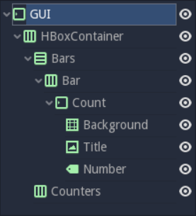

Our scene is still empty. It's time to throw in some textures. To load the textures, head to the FileSystem dock to the left of the viewport. Browse down to the res://assets/GUI folder.

Select the `Background` in the Scene dock. In the Inspector, you should see a `Texture` property. In the FileSystem tab, click and drag `label_HP_bg.png` onto the `Texture` slot. It stays squashed. The parent MarginContainer will force its size down to 0 until we force elements inside the container to have a minimum size. Select the `Background` node. In the Inspector, scroll down to the Rect section. Set `Min Size` to (100, 40). You should see the `Background` resize along with its parent containers.

Next, select the `Title` and drag and drop `label_HP.png` into its `Texture` slot. Select the `Number` node, click the field next to the `Text` property and type `10`. This way, we can see both nodes in the viewport. They should stack up in the top-left corner of their parent `MarginContainer`.

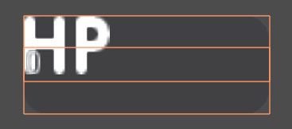

As they have a container as their direct parent, we cannot move them freely: the `Count` node will always reset their anchors, their size and position. Try to move and resize the nodes in the viewport. Then, select any of the three textures and press Ctrl Up or Ctrl Down to reorder them in the Scene dock. They'll snap back to their previous size and position.

Parent containers control the size, the scale, the margins, and the anchors of their direct children. To modify the nodes, you must nest them inside a regular Control or another UI element. We'll use the `Background` as a parent for the `Title` and `Number`. Select both the `Title` and `Number`, and drag and drop them onto `Background`.

Select the `Title` and in the Inspector, change its `Stretch Mode` property to `Keep Centered`. Resize it in the viewport with the `Select Mode` tool so it only takes the left half of the background. Next, select the `Number` node. In the viewport, click the `Anchor` menu and click `Full Rect and Fit Parent`. The node will resize to fit the `Background`. Head to the Inspector and change its `Align` property to `Right`, and the `VAlign` property to `Center`. The text should snap to the center of the `Background`'s right edge. Resize the node horizontally so it takes the right half of the `Background` and there's a bit of padding with the right edge.

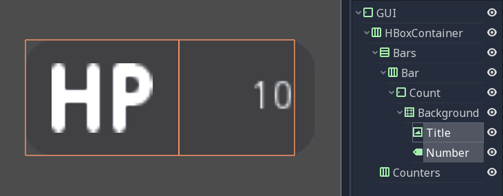

### Replace the Label's font

The label's font is too small. We need to replace it. Select the `Number` node and in the Inspector, scroll down to the `Control` class, and find the `Custom Font` category. Click the field next to the `Font` property and click on `New Dynamic Font`. Click on the field again and select Edit. 

You will enter the `Dynamic Font` resource. Unfold the `Font` category and click the field next to `Font Data`. Click the `Load` button. In the file browser, navigate down to the assets/font folder and double click `Comfortaa-Bold.ttf` to open it. You should see the font update in the viewport. Unfold the settings category to change the font size. Set the `Size` property to a higher value, like `24` or `28`. 

We now need the text's baseline, the number's lower edge, to align with the HP texture on the left. To do so, still in the `DynamicFont` resource, you can tweak the `Bottom` property under the `Extra Spacing` category. It adds some bottom padding to the text. Click the `Number` node in the Scene tab to go back to the node's properties and change the `VAlign` to `Bottom`. To adjust the text's baseline, click on the font field under the `Custom Font` category again and tweak the `Bottom` property until the text aligns with the `Title` node. I used a value of `2` pixels.

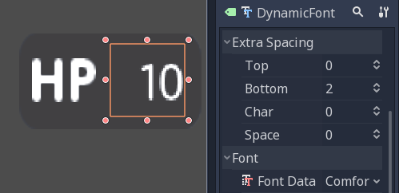

With this, we just finished the hardest part of the GUI. Congratulations! Let's move on to the simpler nodes.

### Add the progress bar

We need one last element to complete our life bar: the gauge itself. Godot ships with a `TextureProgress` node that has everything we need.

Select the Bar node and add a `TextureProgress` inside of it. Name it `Gauge`. In the inspector unfold the `Textures` section. Head to the FileSystem dock and drag and drop the `lifebar_bg.png` texture onto the `Under` slot. Do the same with the `lifebar_fill.png` image and drop it onto the `Progress` slot. Under the `Range` class in the inspector, change the `Value` property to `50` to see the gauge fill up.

With only five `Control` nodes, our first bar is ready to use.

## Design the bomb and rupee counters

The bomb and rupee counters are like the bar's `Count` node. So we'll duplicate it and use it as a template.

Under the `Bar` node, select `Count` and press Ctrl D to duplicate it. Drag and drop the new node under the `Counters` `HBoxContainer` at the bottom of the scene tree. You should see it resize automatically. Don't worry about this for now, we'll fix the size soon.

Rename the `Count2` node to `Counter`. Unlike the bars, we want the number to be on the left, and an icon to sit on the right. The setup is the same: we need background, a `NinePatchFrame`, the title, and the number nodes. The `Title` node is a `TextureRect`, so it's what we need to display the icon. In the scene tree, select the `Title` node, and rename it to `Icon`.

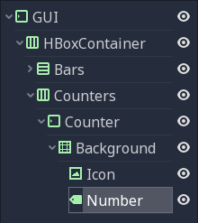

With the `Icon` node selected, in the inspector, scroll to the top to see the `Texture` slot. Head to the FileSystem dock on the left and select the `bombs_icon.png`. Drag and drop it onto the `Texture` slot. In the Scene Tab select both the `Icon` and the `Number` nodes. Click the anchor menu in the toolbar at the top of the viewport and select `Full Rect and Fit Parent`. Both nodes will update to fit the size of the `Background`.

Let's change the `Number`'s align properties to move it to the left and center of the `Background`. Select the `Number` node, change its `Align` property to left and the `VAlign` property to centre. Then resize its left edge a little bit to add some padding between the left edge of the `Background` and the text.

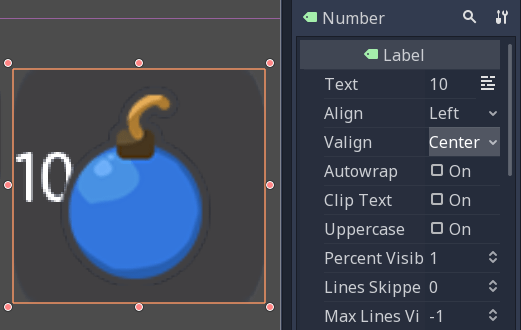

To overlap the Icon and the background, we need a few tweaks. First, our background is a bit too tall. It's because it's inside a margin container that is controlled by the top-most GUI node. Select the GUI node at the top of the scene tree and downsize it vertically so that it's as thin as possible. You'll see the gauge prevents you from making it too small. A container cannot be smaller than the minimal size of its children. The container's margins also weigh in.

Select the Icon, click the Anchor menu, and select `Full Rect and Fit Parent` to re-center it. We need it to anchor to the `Background`'s right edge. Open the Anchor menu again and select `Right Wide`. Move the icon up so it is centered vertically with the `Background`.

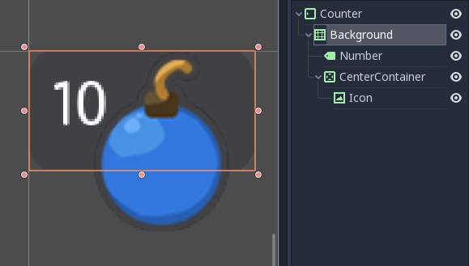

Because we duplicated the `Counter` from the bar's `Count`, the `Number` node's font is off. Select the `Number` node again, head to the `Font` property, and click it  to access the `DynamicFont` resource. In the `Extra Spacing` section, change the `Bottom` value to `0` to reset the font's baseline. Our counter now works as expected.

While we are at it, let's make it so the `Counters` snap to the right edge of the viewport. To achieve this we will set the `Bars` container to expand and take all the horizontal space. Select the `Bars` node and scroll down to the `Size Flags` category. In the `Horizontal` category, check the `Expand` value. The `Bars` node should resize and push the counter to the rightmost of the screen.

## Turn the bar and counter into reusable UI components

We have one bar and one counter widget. But we need two of each. We may need to change the bars' design or their functionality later on. It'd be great if we could have a single scene to store a UI element's template, and child scenes to work on variations. Godot lets us do this with Inherited Scenes. 

Let's save both the `Counter` and the `Bar` branches as separate scenes that we'll reduce to create the `LifeBar`, the `EnergyBar`, the `BombCounter`, and the `RupeeCounter`. Select the `Bar` HBoxContainer. Right click on it and click on `Save Branch as Scene`. Save the scene as `Bar.tscn`. You should see the node branch turn it to a single `Bar` node. 

.. tip:: A scene is a tree of nodes. The topmost node is the tree's **root**, and the children at the bottom of the hierarchy are **leaves**. Any node other than the root along with one more children is a **branch**. We can encapsulate node branches into separate scenes, or load and merge them from other scenes into the active one. Right click on any node in the Scene dock and select `Save Branch as Scene` or `Merge from Scene`.

Then, select the `Counter` node and do the same. Right click,  `Save Branch as Scene`, and save it as `Counter.tscn`. A new edit scene icon appears to the right of the nodes in the scene tree. Click on the one next to `Bar` to open the corresponding scene. Resize the `Bar` node so that its bounding box fits its content. The way we named and place the Control nodes, we're ready to inherit this template and create the life bar. It's the same for the `Counter`.

## Use Scene Inheritance to create the remaining elements

We need two bars that work the same way: they should feature a label on the left, with some value, and a horizontal gauge on the right. The only difference is that one has the HP label and is green, while the other is called EP and is yellow. Godot gives us a powerful tool to create a common base to reuse for all bars in the game: **inherited scenes**.

On an inherited scene, you can change any property of every node in the inspector, aside from its name. If you modify and save the parent scene, all the inherited scenes update to reflect the changes. If you change a value in the inherited scene, it will always overrides the parent's property. It's useful UIs as they often require variations of the same elements. In general, in UI design, buttons, panels etc. share a common base style and interactions. We don't want to copy it over to all variations manually.

A reload icon will appear next to the properties you override. Click it to reset the value to the parent scene's default. 

.. note:: Think of scene inheritance like the node tree, or the `extends` keyword in GDScript. An inherited scene does everything like its parent, but you can override properties, resources and add extra nodes and scripts to extend its functionality.

### Inherit the Bar Scene to build the LifeBar

Go to `Scene -> New Inherited Scene` to create a new type of `Bar`. Select the Bar scene and open it. You should see a new [unsaved] tab, that's like your `Bar`, but with all nodes except the root in grey. Press :kbd:`Ctrl S` to save the new inherited scene and name it `LifeBar`.

First, rename the root or top level node to `LifeBar`. We always want the root to describe exactly what this UI component is. The name differentiates this bar from the `EnergyBar` we'll create next. The other nodes inside the scene should describe the component's structure with broad terms, so it works with all inherited scenes. Like our `TextureProgress` and `Number` nodes.

.. note:: If you've ever done web design, it's the same spirit as working with CSS: you create a base class, and add variations with modifier classes. From a base button class, you'll have button-green and button-red variations for the user to accept and refuse prompts. The new class contains the name of the parent element and an extra keyword to explain how it modifies it. When we create an inherited scene and change the name of the top level node, we're doing the same thing

### Design the EnergyBar

We already setup the `LifeBar`'s design with the main `Bar` scene. Now we need the `EnergyBar`. 

Let's create a new inherited scene, and once again select the `Bar.tscn` scene and open it. Save the new scene as `EnergyBar.tscn`. Double-click on the `Bar` root node and rename it to `EnergyBar`. We need to replace the HP texture with EP one, and to change the textures on the gauge. 

Head to the FileSystem dock on the left, select the `Title` node in the Scene tree and drag and drop the `label_EP.PNG` file onto the texture slot. Select the `Number` node and change the `Text` property to a different value like `14`.

You'll notice the EP texture is smaller than the HP one. We should update the `Number`'s font size to better fit it. A font is a resource. All the nodes in the entire project that use this resource will be affected by any property we change. You can try to change the size to a huge value like `40` and switch back to the `LifeBar` or the `Bar` scenes. You will see the text increased in size.

To change the font size on this node only, we must create a copy of the font resource. Select the `Number` node again and click on the wrench and screwdriver icon on the top right of the inspector. In the drop-down menu, select the `Make Sub-Resources Unique` option. Godot will find all the resources this node uses and create unique copies for us.

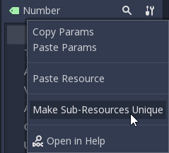

.. tip:: When you duplicate a node from the Scene tree, with :kbd:`Ctrl D`, it shares its resources with the original node. You need to use `Make Sub-Resources Unique` before you can tweak the resources without affecting the source node.

Scroll down to the `Custom Font` section and open `Font`. Lower the `Size` to a smaller value like `20` or `22`. You may also need to adjust the `Bottom` spacing value to align the text's baseline with the EP label on the left.

Now, select the `TextureProgress` node. Drag the `energy_bar_bg.png` file onto the `Under` slot and do the same for `energy_bar_fill.png` and drop it onto the `Progress` texture slot.

you can resize the node vertically so that its bounding rectangle fits the gauge. Do the same with the `Count` node until its size aligns with that of the bar. Because the minimal size of `TextureProgress` is set based on its textures, you won't be able to downsize the `Count` node below that. That is also the size the `Bar` container will have. You may downscale this one as well.

last but not least, the `Count` container has a minimum size that makes it a bit large. Select it and in the `Rect` section, change the `Min Size` property down to `80` pixels. It should resize automatically and the `Title` and `Number` nodes should reposition as well.

.. tip:: The Count node's size affects the position of the TextureProgress. As we'll align our bars vertically in a moment, we're better off using the Counter's left margin to resize our EP label. This way both the EnergyBar's Count and the LifeBar's Count nodes are one hundred pixels wide, so both gauges will align perfectly.

### Prepare the bomb and rupee counters

Let us now take care of the counters. Go to `Scene -> New Inherited Scene` and select the `Counter.tscn` as a base. Save the new scene as `BombCounter.tscn`. Rename the root node as `BombCounter` too. That's all for this scene. 

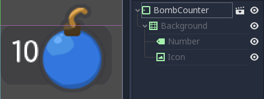

Go to `Scene -> New Inherited Scene` again and select `Counter.tscn` once more. Save the scene as `RupeeCounter.tscn`. Rename the root node `RupeeCounter`. For this one, we mainly need to replace the bomb icon with the rupee icon. In the FileSystem tab, drag the `rupees_icon.PNG` onto the `Icon` node's `Texture` slot. `Icon` already anchors to the right edge of the `Background` node so we can change its position and it will scale and reposition with the `RupeeCounter` container. Shift the rupee icon a little bit to the right and down. Use the Arrow Keys on the keyboard to nudge its position. Save, and we're done with all the UI elements.

## Add the UI components to the final GUI

Time to add all the UI elements to the main GUI scene. Open the `GUI.tscn` scene again, and delete the `Bar` and `Counter` nodes. In the FileSystem dock, find the `LifeBar.tscn` and drag and drop it onto the `Bars` container in the scene tree. Do the same for the `EnergyBar`. You should see them align vertically. 

Now, drag and drop the BombCounter and RupeeCounter scenes onto the Counters node. They'll resize size automatically.

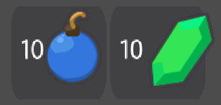

To let the `RupeeCounter` and `BombCounter` use the size we defined in `Counter.tscn`, we need to change the `Size Flags` on the `Counters` container. Select the `Counters` node and unfold the `Size Flags` section in the Inspector. Uncheck the `Fill` tag for the `Vertical` property, and check `Shrink Center` so the container centers inside the `HBoxContainer`.

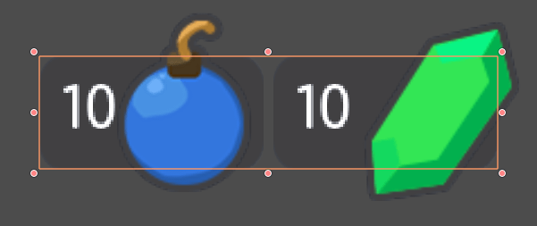

.. tip:: Change the `Min Size` property of the `Counters` container to control the height of the counters' background.

We have one small issue left with the EP label on the EnergyBar: the 2 bars should align vertically. Click the icon next to the `EnergyBar` node to open its scene. Select the `Count` node and scroll down to the `Custom Constant` section. As a add a `Margin Left` of `20`. In the `Rect` section set the node's `Min Size` back to 100, the same value as on the LifeBar. The `Count` should now have some margin on the left. If you save and go back to the GUI scene, it will be aligned vertically with the Life` `Bar.

.. note:: We could have setup the `EnergyBar` this way a few moments ago. But this shows you that you can go back to any scene anytime, tweak it, and see the changes propagate through the project!

## Place the GUI onto the game's mockup

To wrap up the tutorial we're going to insert the GUI onto the game's mockup scene.

Head to the FileSystem dock and open `LevelMockup.tscn`.

Drag-and-drop the `GUI.tscn` scene right below the `bg` node and above the `Characters`. The GUI will scale to fit the entire viewport. Head to the anchor menu and select the `Top Wide` option so it anchors to the top edge of the game window. Then resize the GUI to make it as small as possible vertically. Now you can see how the interface looks in the context of the game.

Congratulations for getting to the end of this long tutorial. You can find final project [here](#).

.. note:: **A final note about Responsive Design**. If you resize the GUI, you'll see the nodes move, but the textures and text won't scale. The GUI also has a minimum size, based on the textures inside of it. In games, we don’t need the interface to be as flexible as that of a website. You almost never want to support both landscape and portrait screen orientations. It’s one of the other. In landscape orientation, the most common ratios range from 4:3 to 16:10. They are close to one another. That’s why it’s enough for the GUI elements to only move horizontally when we change the window size.
