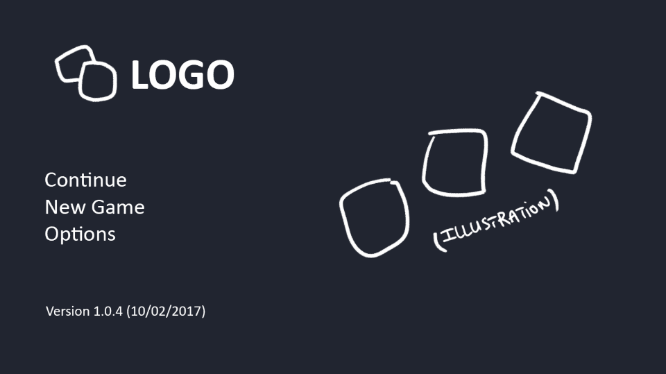
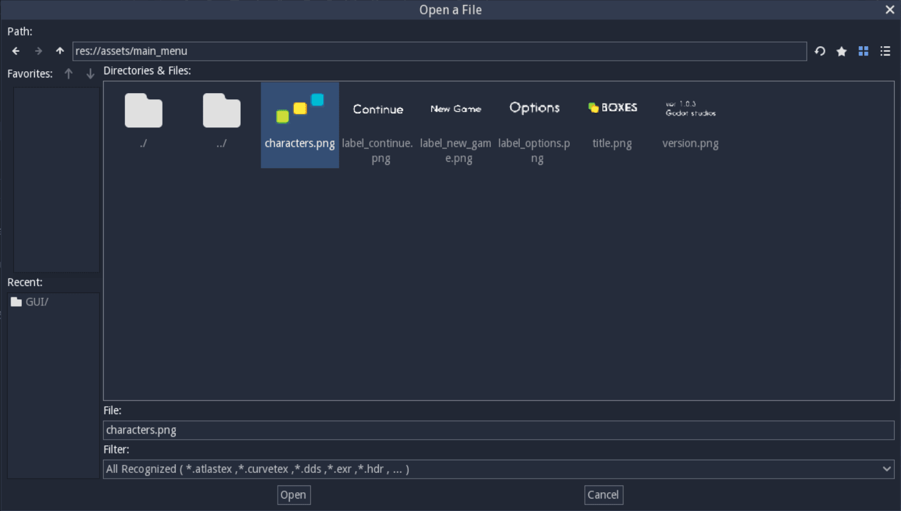
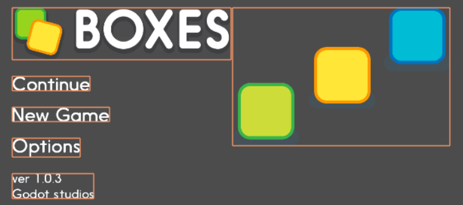
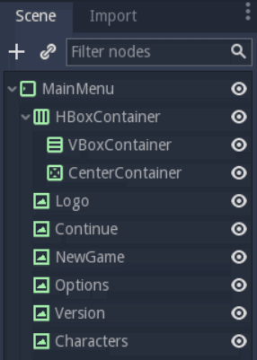
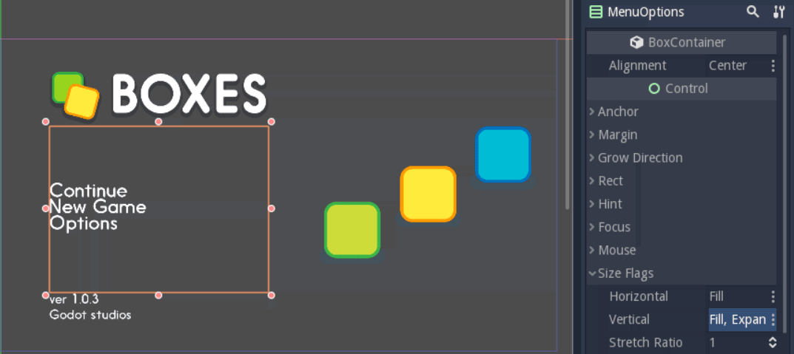

In this tutorial, you will build 2 responsive UI scenes step-by-step using the engine's UI system:

1. A main menu
1. A GUI (Game User Interface) with a lifebar, energy bar, bombs and money counters

You will learn how to design game UI efficiently, and how to use Godot's Control nodes. This page focuses on the visual part: everything you do from the editor. The next page will teach you how to control the User Interface with signals and GDscript.

.. note: Read the ref:`ui_design_guide` first to learn how Godot’s UI system works

## How to design your game UI

To design good UI, you want to come up with a rough mockup first: a plain drawing version that focuses on the placement of your UI components, their size, and user interaction. Pen and paper is all you need. You shouldn't use fancy and final graphics at this stage. Then, you only need simple sprites and you're good to jump into Godot. You want to make sure the players can find their way around the interface with placeholder sprites. 

Placeholder doesn't have to mean ugly, but you should keep the graphics simple and clean. Avoid special effects, animation, and detailed illustration before you had players playtest your UI. Otherwise:

1. The graphics might skew the players' perception of the experience and you'll miss on valuable feedback
1. If the User Experience doesn't work, you'll have to redo some sprites

.. tip:: Always try to make the interface work with simple text and boxes first. It's easy to replace the textures later. Professional UX designers often work with plain outlines and boxes in greyscale. When you take colors and fancy visuals away, it's a lot easier to size and place UI elements properly. It helps you refine the design foundation you'll build upon.

There are 2 ways to design your UI in Godot. You can:

1. Build it all in a single scene, and eventually save some branches as reusable scenes
1. Build template scenes for reusable components and create specific components that inherit from your base scenes

We will use the first approach, because the first version of your UI may not work as well as you’d like. You’re likely to throw parts away and redesign components as you go. When you're sure everything works, it's easy to make some parts reusable, as you'll see below.

Please download :download:`ui_design.zip </files/ui_design.zip>`. It contains all the files you'll need to follow along. You'll find all the sprites in the `assets/main_menu` folder.

## Design the main menu

Before we jump into the editor, we want to plan how we'll nest containers based on our mockup image.

### Break down the UI mockup

Here's are my 3 rules of thumb to find the right containers:

1. Break down the UI into nested boxes, from the largest that englobes everything, to the smallest ones, that encompass one widget, like a bar with its label, a panel or a button
1. If there's some padding around an area, use a `MarginContainer`
1. If the elements are arranged in `rows` or columns, use an HBoxContainer or VBoxContainer

These rules are enough to get us started, and work well for simple interfaces.

For the main menu, the largest box is the entire game window. There's padding between the edges of the window and the first components: this should be a `MarginContainer`. Then, the screen is split into 2 columns, so we'll use an HBoxContainer. In the left column, we'll manage the rows with a VBoxContainer. And in the right column, we'll center the illustration with a CenterContainer.

.. tip:: Containers adapt to the window's resolution and width to height ratio. Although we could place UI elements by hand, containers are faster, more precise, and [ responsive ]().

### Prepare the Main Menu scene

Let's create the main menu. We'll build it in a single scene. To create an empty scene, click on the Scene menu -> New Scene. 

We have to add a root node before we can save the scene. Your UI's root should be the outer container or element. In this case it's a `MarginContainer`. `MarginContainer` is a good starting point for most interfaces, as you often need padding around the UI. Press :kbd:`Ctrl S` to save the scene to the disk. Name it MainMenu.

Select the `MarginContainer` again, and head to the inspector to define the margins' size. Scroll down the `Control` class, to the `Custom Constants` section. Unfold it. Set the margins as such:

- Margin Right: 120
- Margin Top: 80
- Margin Left: 120
- Margin Bottom: 80

We want the container to fit the window. In the Viewport, open the Anchor menu and select the last option, `Full Rect and Fit Parent`.

### Add the UI sprites

Select the `MarginContainer`, and create the UI elements as `TextureRect` nodes. We need:

1. The title, or logo
1. The 3 text options, as individual nodes
1. The version note 
1. And the main menu’s illustration

Click the `Add Node` button or press :kbd:`Ctrl A` on your keyboard. Start to type `TextureRect` to find the corresponding node and press enter. With the new node selected, press :kbd:`Ctrl D` 5 times to create 5 extra `TextureRect` instances.

Click each of the nodes to select it. In the inspector, click the `… ` Icon to the right of the Texture property, and click on `Load`. A file browser opens and lets you pick a sprite to load into the texture slot. 

Repeat the operation for all `TextureRect` nodes. You should have the logo, the illustration, the 3 menu options and the version note, each as a separate node. Then, double click on each of the nodes in the Inspector to rename them

.. note:: If you want to support localization in your game, use `Labels` for menu options instead of `TextureRect`.

### Add containers to place UI elements automatically

Our main menu has some margin around the edges of the screen. It is split in two parts: on the left, you have the logo and the menu options. On the right, you have the characters. We can use one of 2 containers to achieve this: `HSplitContainer` or `HBoxContainer`. Split containers split the area into 2: a left and a right side or a top and a bottom side. They also allow the user to resize the left and right areas using an interactive bar. On the other hand, `HBoxContainer` just splits itself into as many columns as it has children. Although you can deactivate the split container's resize behaviour, I recommend to favour box containers.

Select the `MarginContainer` and add an `HBoxContainer`. Then, we need 2 containers as children of our `HBoxContainer`: a `VBoxContainer` for the menu options on the left, and a `CenterContainer` for the illustration on the right.

In the node tree, select all the `TextureRect` nodes that should go on the left side: the logo, the menu options and the version note. Drag and drop them into the `VBoxContainer`. Then, drag the illustration node into the `CenterContainer`. The nodes should position automatically.

We're left with 2 problems to solve:

1. The characters on the right aren't centered
1. There's no space between the logo and the other UI elements

To center the characters on the right, we'll use a `CenterContainer`. Add a `CenterContainer` node inside the `VBoxContainer`, then drag and drop the Characters into it. The Characters element will center automatically.

To space out the menu options and the logo on the left, we'll use one final container and its size flags. Select the `VBoxContainer` and press :kbd:`Ctrl A` to add a new node inside it. Add a second `VBoxContainer` and name it "MenuOptions". Select all 3 menu options, `Continue`, `NewGame` and `Options`, and drag and drop them inside the new `VBoxContainer`. The UI's layout should barely change, if at all.

Now we grouped the menu options together, we can tell their container to expand to take as much vertical space as possible. Select the `MenuOptions` node. In the Inspector, scroll down to the `Size Flags` category. Click on the field to the right of the `Vertical` property, and check `Expand`. The container expands to take all the available vertical space. But it respects its neighbors, the `Logo` and `Version` elements.

To center the nodes in the `VBoxContainer`, scroll to the top of the Inspector and change the `Alignment` property to `Center`.

To wrap things up, let's add some separation between the menu options. Expand the `Custom Constants` category below `Size Flags`, and click the field next to the `Separation` parameter. Set it to 30. Once you press enter, the `Separation` property becomes active and Godot adds 30 pixels between menu options.

Without a single line of code, we have a precise and a responsive main menu. 

Congratulations for getting there! You can download the [ final menu ](#) to compare with your own. In the next tutorial, you'll create a Game User Interface with bars and item counters.

.. note:: 

  Responsive User Interface is all about making sure our UIs scale well on all screen types. TV screens and computer displays have different sizes and ratios. In Godot, we use containers to control the position and the size of UI elements. The order in which you nest matters. To see if your UI adapts nicely to different screen ratios, select the root node, press the Q key to activate the Select Mode, select the container and click and drag on one of the container's corners to resize it. The UI components should flow inside of it.
  You'll notice although containers move sprites around, they don't scale them. This is normal. We want the UI system to handle different screen ratios, but we also need the entire game to scale to adapt to different screen resolutions. To do this, Godot scales the entire window up and down. You can change the scale mode in the project settings: click the Project menu -> Project Settings. In the window's left column, look for the Display category. Click on the Window sub-category. On the right side of the window, you'll find a Stretch section. The 3 settings, Mode, Aspect, and Shrink, control the screen size. For more information, see [ Project Settings ](#)
